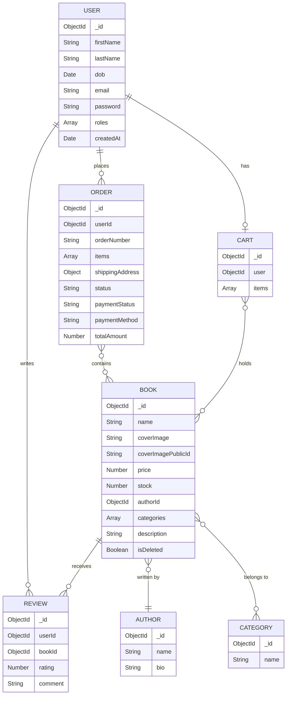

<p align="center">
  
  
  
  
  
</p>

# 📚 WyrnHole — E-Commerce Bookstore (Backend)

The **backend** REST API for WyrnHole, a full-stack e-commerce bookstore platform built with the **MEAN** stack. This Express 5 server provides a secure, scalable API with JWT + OTP authentication, Cloudinary image hosting, Stripe payment integration, and MongoDB transactions.

> 🔗 **Frontend Repository:** [ecommerce-frontend](https://github.com/Mohamed-Samehh/ecommerce-frontend)

---

## 🧰 Tech Stack

| Technology | Purpose |
|---|---|
| **Node.js + Express 5** | REST API server |
| **MongoDB + Mongoose 9** | Database & ODM |
| **JWT + Bcrypt.js** | Authentication & password hashing |
| **Nodemailer** | OTP email delivery (SMTP) |
| **Cloudinary** | Image storage CDN |
| **Multer + Sharp** | File upload & image processing |
| **Stripe** | Online payment processing |
| **Joi** | Request/query validation |
| **Pino** | Structured logging |
| **ESLint** | Code quality (@antfu/eslint-config) |

---

## 📁 Project Structure

```
├── config/                    # Configuration
│   ├── .env.example           # Environment variable template
│   ├── cloudinary.js          # Cloudinary SDK setup
│   └── upload.js              # Multer file upload config
├── controllers/               # 9 route controllers
│   ├── auth.js                # Register, login, OTP, profile
│   ├── book.js                # CRUD + aggregation queries
│   ├── cart.js                # Add, remove, update, count
│   ├── order.js               # Place order, status updates (w/ transactions)
│   ├── review.js              # Add, get, delete reviews
│   ├── admin.js               # User management (admin only)
│   ├── author.js              # Author CRUD
│   └── category.js            # Category CRUD
├── middleware/                 # 7 middleware handlers
│   ├── auth.js                # JWT verification
│   ├── admin.js               # Admin role check
│   ├── async-handler.js       # Async error wrapper
│   ├── validate-request.js    # Joi body validation
│   ├── validate-query.js      # Joi query validation
│   ├── book-ref-validations.js # Author/category existence check
│   └── cloudinary-service.js  # Image upload to Cloudinary
├── models/                    # 7 Mongoose models
│   ├── user.js                # User (w/ password hashing hooks)
│   ├── book.js                # Book (w/ aggregation statics, virtuals)
│   ├── author.js              # Author
│   ├── category.js            # Category
│   ├── cart.js                # Cart (1-to-1 user mapping)
│   ├── order.js               # Order (w/ auto order-number generation)
│   └── review.js              # Review (unique per user-book pair)
├── routes/                    # 8 route modules
├── utils/                     # Shared utilities
│   ├── jwt.js                 # Token signing
│   ├── otp.js                 # OTP generation & store
│   ├── mailer.js              # Email transporter (Nodemailer)
│   ├── validations.js         # Joi schemas
│   ├── logger.js              # Pino logger
│   ├── error-handler.js       # Centralized error handler
│   └── cloudinary-handler.js  # Cloudinary delete utility
└── index.js                   # App entry point
```

---

## 🔌 API Endpoints

### Auth (`/auth`)
| Method | Endpoint | Description | Auth |
|--------|----------|-------------|------|
| `POST` | `/auth/register` | Register (sends OTP) | — |
| `POST` | `/auth/verify-otp` | Verify registration OTP | — |
| `POST` | `/auth/login` | Login (sends OTP) | — |
| `POST` | `/auth/verify-login-otp` | Verify login OTP | — |
| `GET` | `/auth/me` | Get current user | 🔒 |
| `PATCH` | `/auth/me` | Update current user | 🔒 |

### Books (`/books`)
| Method | Endpoint | Description | Auth |
|--------|----------|-------------|------|
| `GET` | `/books` | List books (filter, sort, paginate) | — |
| `GET` | `/books/:id` | Get book details (w/ reviews & ratings) | — |
| `POST` | `/books` | Create book (w/ image upload) | 🔒 Admin |
| `PUT` | `/books/:id` | Replace book | 🔒 Admin |
| `PATCH` | `/books/:id` | Update book | 🔒 Admin |
| `DELETE` | `/books/:id` | Soft-delete book | 🔒 Admin |

### Cart (`/cart`)
| Method | Endpoint | Description | Auth |
|--------|----------|-------------|------|
| `GET` | `/cart` | Get user's cart | 🔒 |
| `GET` | `/cart/count` | Get cart item count | 🔒 |
| `POST` | `/cart` | Add book to cart | 🔒 |
| `PATCH` | `/cart/:bookId` | Update item quantity | 🔒 |
| `DELETE` | `/cart/:bookId` | Remove item from cart | 🔒 |

### Orders (`/order`)
| Method | Endpoint | Description | Auth |
|--------|----------|-------------|------|
| `POST` | `/order` | Place order (w/ transaction) | 🔒 |
| `GET` | `/order/my` | Get user's orders | 🔒 |
| `GET` | `/order` | Get all orders | 🔒 Admin |
| `GET` | `/order/:id` | Get order by ID | 🔒 |
| `PATCH` | `/order/:id/status` | Update order status | 🔒 Admin |
| `PATCH` | `/order/:id/payment` | Update payment status | 🔒 Admin |

### Reviews (`/review`)
| Method | Endpoint | Description | Auth |
|--------|----------|-------------|------|
| `POST` | `/review` | Add/update review | 🔒 |
| `GET` | `/review/book/:bookId` | Get book reviews | — |
| `GET` | `/review/my` | Get user's reviews | 🔒 |
| `GET` | `/review` | Get all reviews | 🔒 Admin |
| `DELETE` | `/review/:id` | Delete review | 🔒 |

### Admin (`/admin`)
| Method | Endpoint | Description | Auth |
|--------|----------|-------------|------|
| `GET` | `/admin/users` | List users (search, filter, paginate) | 🔒 Admin |
| `GET` | `/admin/users/:id` | Get user by ID | 🔒 Admin |
| `POST` | `/admin/users` | Create user | 🔒 Admin |
| `PATCH` | `/admin/users/:id` | Update user | 🔒 Admin |
| `DELETE` | `/admin/users/:id` | Delete user | 🔒 Admin |

### Authors (`/authors`) & Categories (`/categories`)
| Method | Endpoint | Description | Auth |
|--------|----------|-------------|------|
| `GET` | `/authors` | List all authors | — |
| `POST` | `/authors` | Create author | 🔒 Admin |
| `PATCH` | `/authors/:id` | Update author | 🔒 Admin |
| `DELETE` | `/authors/:id` | Delete author | 🔒 Admin |
| `GET` | `/categories` | List all categories | — |
| `POST` | `/categories` | Create category | 🔒 Admin |
| `PATCH` | `/categories/:id` | Update category | 🔒 Admin |
| `DELETE` | `/categories/:id` | Delete category | 🔒 Admin |

---

## 🗄️ Database Schema



---

## 🔒 Security

- **JWT Authentication** with token verification middleware
- **OTP Verification** on both registration and login (2-minute expiry)
- **Password Hashing** with bcrypt (auto-hash on save & update via Mongoose hooks)
- **Role-Based Access** — `admin` middleware guards admin-only routes
- **Input Validation** via Joi schemas on all request bodies and query params
- **CORS Protection** restricted to configured frontend origin
- **Soft Delete** for books to preserve order/review data integrity
- **MongoDB Transactions** for order placement and cancellation (atomicity)
- **Centralized Error Handling** with structured error responses

---

## 🚀 Getting Started

### Prerequisites

- **Node.js** ≥ 18.x
- **npm** ≥ 9.x
- **MongoDB Atlas** account (or local MongoDB instance)
- **Cloudinary** account (for image uploads)
- **SMTP Email** service (for OTP emails)
- **Stripe** account (for online payments — optional)

### Installation

```bash
git clone https://github.com/Mohamed-Samehh/ecommerce-backend.git
cd ecommerce-backend
npm install
```

### Configuration

Create a `.env` file in the `config/` directory based on `.env.example`:

```env
MONGO_URI=mongodb+srv://<username>:<password>@cluster.mongodb.net/bookstore
PORT=3000
JWT_SECRET=your-secret-key
FRONTEND_URL=http://localhost:4200

CLOUDINARY_CLOUD_NAME=your-cloud-name
CLOUDINARY_API_KEY=your-api-key
CLOUDINARY_API_SECRET=your-api-secret

EMAIL_HOST=smtp.example.com
EMAIL_PORT=587
EMAIL_USER=your-email@example.com
EMAIL_PASS=your-email-password
EMAIL_FROM_NAME=WyrnHole
EMAIL_FROM=noreply@wyrnhole.com
```

### Run

```bash
# Development (with hot reload via Nodemon)
npm run dev

# Production
npm start
```

The API will be running at `http://localhost:3000`.

---

## 🌐 Deployment

Deployed on **Vercel** as a serverless function.

> Set all environment variables on Vercel (Mongo URI, Cloudinary keys, JWT secret, Stripe keys, email config, and `FRONTEND_URL` pointing to the deployed frontend).

---

## 👥 Team

- **Alaa Abdallah**
- **Andrew**
- **Mohammed Abdelhaq**
- **Mohammed Sameh**

---

## 📄 License

This project is licensed under the **ISC License**.

---

<p align="center">
  Made with ❤️ by the WyrnHole Team
</p>
